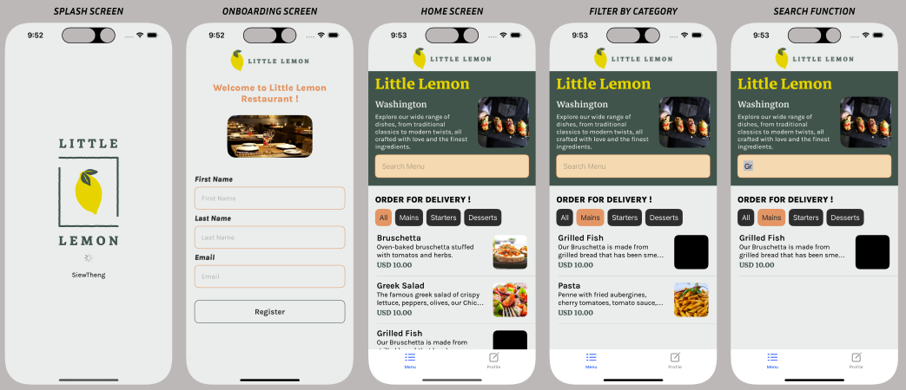
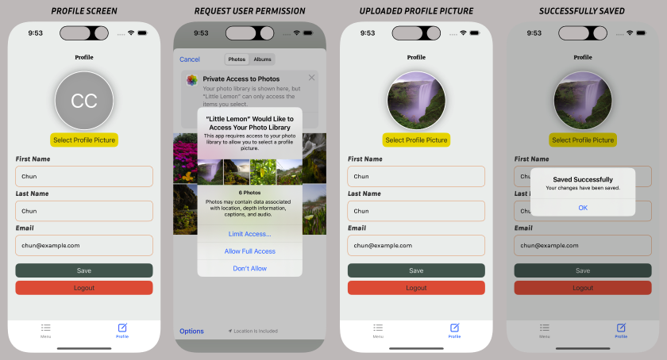
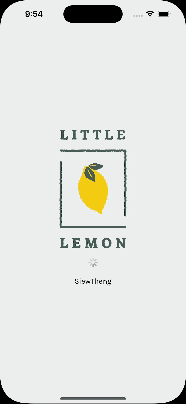

# 🍋 Little Lemon App 🍋

The Little Lemon app allows customers to browse, search, and order food for delivery/pickup from a fictional restaurant. It was built as the capstone project for the Meta iOS Developer Specialization (Coursera).

## Overview 📝
The key features include:
* Account creation
* Browsing menu by category
* Searching for dishes by name
* Customising user profile

## Screenshots 📸

## Tech Stack 💻
* SwiftUI
* Core Data
* Combine
* URLSession
* UserDefaults

## Running the Project ▶️
The app can be tested on iOS stimulator.
1. Clone the repository
2. Open 'Little Lemon.xcodeproj' with Xcode
3. Click the Run button to build and run the project

### Key Learnings 🗝️
* Applying UX/UI principles to create effective mobile app interfaces and flows using Figma. This included building wireframes, Auto Layout components, variants, and high-fidelity mockups.
* Learned how to build reusable components in Figma and sync them across design files.
* Demonstrates the use of SwiftUI, Apple's declarative framework for building interfaces, featuring views like VStack, Text, and Image.
* Employs SwiftUI’s @State property wrapper to manage local state within views, essential for reactive UI updates.
* Uses NavigationStack and navigationPath to manage app navigation, showing proficiency in SwiftUI's navigation model.
* Implements asynchronous programming with DispatchQueue.main.asyncAfter in the onAppear modifier to handle delayed actions and animations.
* Utilizes .fullScreenCover for presenting a full-screen modal view based on a state variable, showing advanced UI management.
* Manages data persistence using UserDefaults for storing simple data like user credentials.
* Constructs complex user input forms with multiple inputs, implementing logic to enable or disable form submission based on input validation.
* Fetches data from a remote source using URLSession and decodes JSON data with JSONDecoder, essential for apps that consume external APIs.
* Integrates Core Data for managing and persisting app data locally, including fetching, saving, and updating data based on external JSON sources.
* Renders UI components dynamically and conditionally, handling loading states for a responsive app design.
* Extends functionality with custom utility functions such as predicates for filtering data in Core Data, demonstrating an ability to customize solutions to fit specific needs.

### Challenges 🚧
* Given the complexity of the app's state management with @State, @Environment, and Core Data, ensuring that data flows correctly and efficiently throughout the app can be challenging. This includes maintaining synchronization between the UI and the underlying data model, especially when dealing with asynchronous data fetching and updates.
* The current implementation involves networking and data operations which are prone to errors, such as network failures or corrupted data states. Properly handling these errors to ensure the app remains robust and user-friendly under all conditions can be challenging.

### Future Enhancements 🚀
* Implement account authentication with login
    * Allow users to create accounts and log in using email/password or social media login APIs. This provides secure access to their profile and order history.
* Add items to a persistent cart
    * Enable users to add menu items to a cart that persists between sessions. They can view and edit the cart before checkout.
* Build out dish details pages
    * Individual dish pages could show ingredients, full descriptions, photos, and reviews. Users could add items directly to their cart from these pages.
* Integrate a payment API
    * Process orders by integrating a payment platform like Stripe to accept credit card payments securely within the app.
* Incorporate reservation functionality
    * Allow customers to book and manage upcoming reservations directly through the app interface.
* Implement push notifications
    * Send push notifications to notify users of reservation confirmations, order status updates and special deals.
